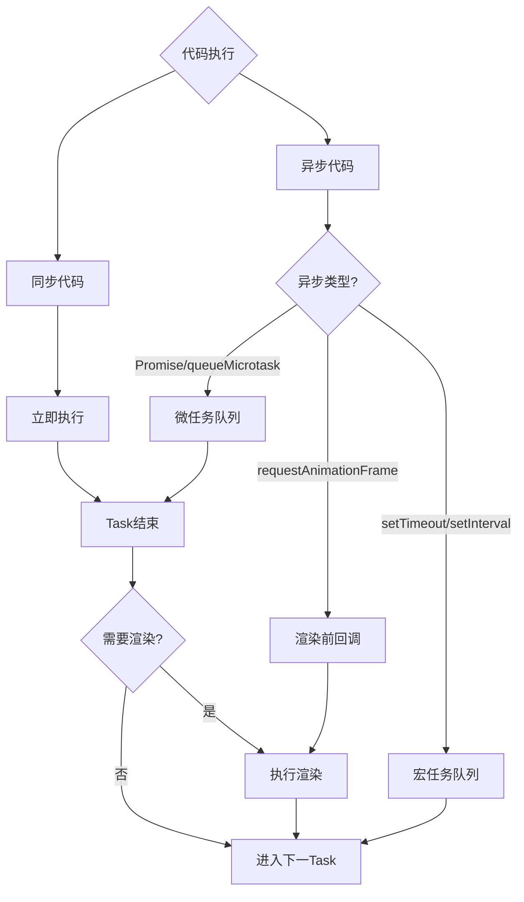

# 前端核心原理 - 优化补充内容
## 第二阶段:可视化增强补充
### 事件循环决策树

### V8优化检查清单
| 检查项 | 优化前 | 优化后 | 性能提升 |
|--------|--------|--------|---------|
| 对象形状稳定性 | 频繁增删属性 | 初始化时定义所有字段 | 3-5倍 |
| 类型稳定性 | 混用多种类型 | 类型路径分离 | 2-3倍 |
| 数组形态 | 稀疏数组/混合类型 | 紧凑同类型数组 | 5-10倍 |
| 临时对象 | 每帧创建大量对象 | 对象复用 | 减少GC 50% |
| 强制同步布局 | 交错读写DOM | 批量操作 | 3-5倍 |
## 第三阶段:实战案例补充
### 案例1:电商首页LCP优化(3.5s → 1.2s)
**问题诊断:**
- 首屏图片未优化,总大小12MB
- 关键JS未拆分,首屏加载500KB
- 未使用预加载策略
**优化方案:**
1. 图片转WebP格式,体积减少60%(12MB → 4.8MB)
2. 关键路径JS拆分,首屏JS减少到150KB
3. 添加preload/preconnect,节省200-300ms
4. 使用虚拟滚动,减少DOM节点90%
**结果:**
- LCP: 3.5s → 1.2s (65%提升)
- FID: 150ms → 45ms (70%提升)
- CLS: 0.15 → 0.05 (67%提升)
### 案例2:后台系统内存泄漏排查
**泄漏症状:**
- 页面运行2小时后内存从200MB增长到800MB
- 切换路由后内存不回落
**排查步骤:**
1. Performance面板录制,发现频繁GC且停顿时间长
2. Memory面板对比快照,发现EventListener对象数量持续增长
3. 定位到路由切换时未解绑全局事件监听
4. 修复:在组件卸载时调用removeEventListener
**修复代码:**
```javascript
// 修复前:内存泄漏
mounted() {
  window.addEventListener('resize', this.handleResize);
}
// 修复后:正确清理
mounted() {
  window.addEventListener('resize', this.handleResize);
},
beforeUnmount() {
  window.removeEventListener('resize', this.handleResize);
}
```
**结果:**
- 内存稳定在200-250MB
- GC停顿从200ms降至20ms
### 案例3:可视化大屏GC优化
**问题:**
- 实时数据更新导致频繁GC,帧率从60fps降至20fps
- 每秒创建数千个临时对象
**优化方案:**
1. 使用对象池复用数据结构
2. 减少动画帧内的对象分配
3. 使用TypedArray替代普通数组
4. 批量更新DOM而非逐个更新
**性能对比:**
| 指标 | 优化前 | 优化后 | 提升 |
|------|--------|--------|------|
| 帧率 | 20fps | 58fps | 190% |
| GC停顿 | 150ms | 15ms | 90% |
| 内存 | 500MB | 180MB | 64% |
## 第四阶段:互动学习元素
### 自测题集
#### 第一章:浏览器渲染
**Q1(选择题):** 以下哪个属性修改会触发重排?
A. color B. opacity C. width D. transform
答案:C(width涉及布局计算)
**Q2(代码题):** 优化以下代码,避免强制同步布局
```javascript
// 不好的写法
for(let i = 0; i < elements.length; i++) {
  elements[i].style.width = elements[i].offsetWidth + 10 + 'px';
}
// 优化答案:先读后写
const widths = [];
for(let i = 0; i < elements.length; i++) {
  widths.push(elements[i].offsetWidth);
}
for(let i = 0; i < elements.length; i++) {
  elements[i].style.width = widths[i] + 10 + 'px';
}
```
**Q3(场景题):** 如何优化1000条数据列表的渲染性能?
答案:使用虚拟列表,只渲染可见区域的20-30条,性能提升30-50倍
#### 第二章:事件循环
**Q1(代码题):** 预测输出顺序
```javascript
console.log('start');
Promise.resolve().then(() => console.log('promise'));
setTimeout(() => console.log('timeout'), 0);
console.log('end');
```
答案:start → end → promise → timeout
**Q2(场景题):** 如何避免async/await导致的串行等待?
答案:使用Promise.all并行执行不相关的异步任务
#### 第五章:V8与GC
**Q1(选择题):** 以下哪个操作会导致数组元素类型退化?
A. push() B. delete arr[i] C. arr[0] = 1 D. slice()
答案:B(delete会产生空洞,导致HOLEY类型)
**Q2(代码题):** 写出对象形状稳定的创建方式
```javascript
// 不稳定
const obj = { id: 1 };
if (name) obj.name = name;
// 稳定
const obj = { id: 1, name: name || null };
```
## 第五阶段:前沿技术补充
### Core Web Vitals优化指南
#### LCP(Largest Contentful Paint)优化
- 目标:≤2.5s
- 优化方向:
  1. 减少关键资源加载时间(preload/preconnect)
  2. 减少CSS/JS阻塞时间
  3. 优化服务端响应时间
  4. 使用CDN加速
#### FID(First Input Delay)优化
- 目标:≤100ms
- 优化方向:
  1. 减少主线程长任务(>50ms)
  2. 使用Web Worker处理重计算
  3. 拆分大型JavaScript
  4. 使用requestIdleCallback处理低优先级任务
#### CLS(Cumulative Layout Shift)优化
- 目标:≤0.1
- 优化方向:
  1. 为图片/视频预留空间
  2. 避免在已有内容上方插入新内容
  3. 使用transform而非改变布局属性
### HTTP/3与QUIC的面试要点
- QUIC基于UDP,连接建立更快(1-RTT vs 3-RTT)
- 支持连接迁移,网络切换时无需重新建立连接
- 多路复用改进,避免TCP的队头阻塞
- 面试答法:HTTP/3主要优化了连接建立速度和网络切换体验,但浏览器支持度还在提升中
### WebAssembly的适用场景
- 适合:图像处理、音视频编解码、复杂算法计算、游戏引擎
- 不适合:普通业务逻辑、DOM操作、网络请求
- 面试答法:Wasm是性能优化的最后手段,不是常规方案
### 2024-2026年面试趋势
1. **性能指标升级:**从FCP/LCP升级到INP(Interaction to Next Paint)
2. **边缘计算:**Edge Computing、Serverless优化
3. **AI集成:**LLM在前端的应用(代码生成、智能推荐)
4. **隐私保护:**Privacy Sandbox、第一方数据收集
5. **框架演进:**Server Components、流式渲染、部分预渲染
### 不同公司的面试侧重点
| 公司类型 | 侧重点 | 典型问题 |
|---------|--------|---------|
| 大厂(BAT) | 性能优化、架构设计 | 如何优化首屏加载?如何设计高可用系统? |
| 创业公司 | 快速迭代、全栈能力 | 如何快速实现功能?如何做性能监控? |
| 金融公司 | 稳定性、安全性 | 如何保证数据安全?如何做容错设计? |
| 游戏公司 | 性能、渲染 | 如何优化Canvas性能?如何做3D渲染? |
### 5年vs10年经验的差异化准备
**5年经验重点:**
- 深入理解核心原理(浏览器、V8、事件循环)
- 能讲清性能优化的具体案例
- 掌握常见工具使用(DevTools、Lighthouse)
**10年经验重点:**
- 系统性架构思维(如何设计大型系统)
- 业务与技术的平衡(ROI、成本考量)
- 团队建设与技术决策(如何选型、如何推进)
- 前瞻性(对新技术的理解和预判)
