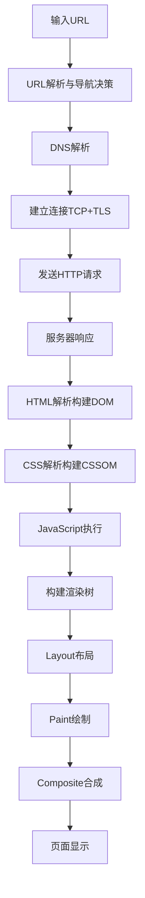
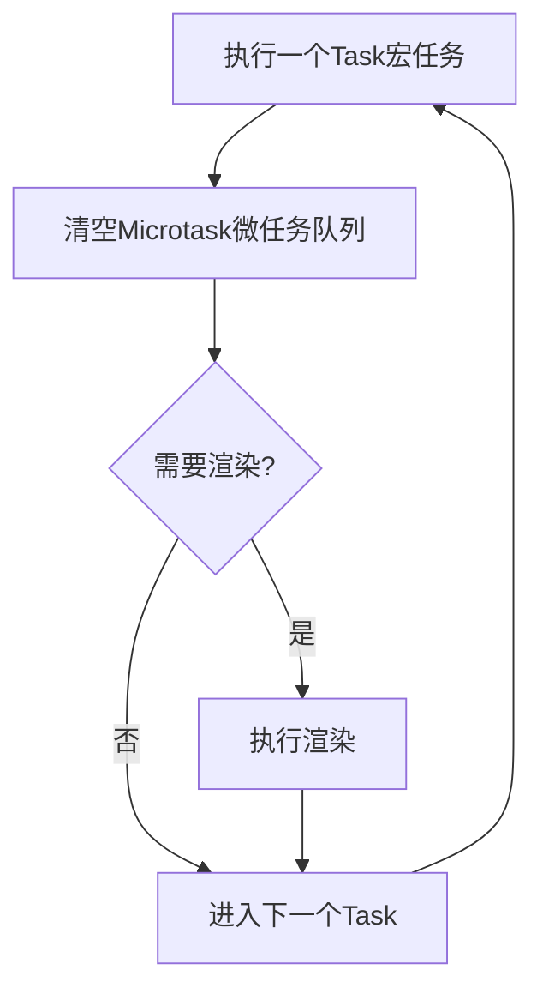
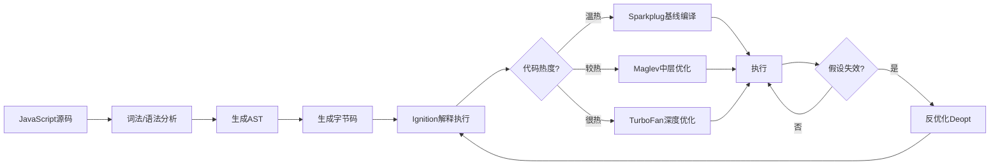
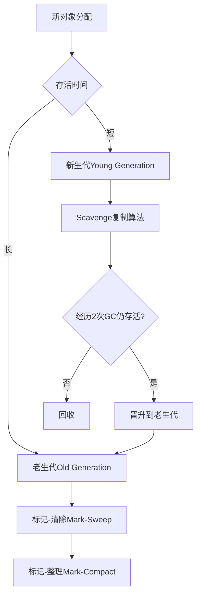

# 前端核心原理
## 文档定位
面向5-10年前端岗位,聚焦浏览器渲染、事件循环、缓存、同源策略与跨域、V8引擎与垃圾回收这几块最常被深挖的底层原理。目标不是背概念,而是能讲清链路、边界、优化点和面试答法,帮助你在中高级前端面试中建立系统性的知识体系,同时能将这些原理直接应用到项目性能优化和问题排查中。
## 目录
- [第一章 浏览器渲染原理](#第一章-浏览器渲染原理)
  - [1.1 从输入URL到页面显示的完整链路](#11-从输入url到页面显示的完整链路)
  - [1.2 渲染树、重排、重绘、合成的关系](#12-渲染树重排重绘合成的关系)
  - [1.3 性能优化](#13-性能优化)
  - [1.4 面试高频问答](#14-面试高频问答)
- [第二章 事件循环与异步编程](#第二章-事件循环与异步编程)
  - [2.1 浏览器事件循环](#21-浏览器事件循环)
  - [2.2 Node.js事件循环](#22-nodejs事件循环)
  - [2.3 Promise与async/await最佳实践](#23-promise与asyncawait最佳实践)
  - [2.4 面试高频问答](#24-面试高频问答)
- [第三章 浏览器缓存机制](#第三章-浏览器缓存机制)
  - [3.1 缓存的大图景](#31-缓存的大图景)
  - [3.2 强缓存](#32-强缓存)
  - [3.3 协商缓存](#33-协商缓存)
  - [3.4 Service Worker缓存](#34-service-worker缓存)
  - [3.5 面试高频问答](#35-面试高频问答)
- [第四章 同源策略与跨域](#第四章-同源策略与跨域)
  - [4.1 什么是同源](#41-什么是同源)
  - [4.2 同源策略限制了什么](#42-同源策略限制了什么)
  - [4.3 CORS](#43-cors)
  - [4.4 常见跨域方案](#44-常见跨域方案)
  - [4.5 面试高频问答](#45-面试高频问答)
- [第五章 V8引擎与垃圾回收](#第五章-v8引擎与垃圾回收)
  - [5.1 先把V8说准确](#51-先把v8说准确)
  - [5.2 V8执行JavaScript的完整链路](#52-v8执行javascript的完整链路)
  - [5.3 V8为什么快](#53-v8为什么快)
  - [5.4 垃圾回收的核心机制](#54-垃圾回收的核心机制)
  - [5.5 前端项目里的V8与GC优化](#55-前端项目里的v8与gc优化)
  - [5.6 内存泄漏与GC问题怎么排查](#56-内存泄漏与gc问题怎么排查)
  - [5.7 面试高频问答](#57-面试高频问答)
- [第六章 高频综合问答](#第六章-高频综合问答)
- [第七章 复习顺序建议](#第七章-复习顺序建议)
- [第八章 一句话总结](#第八章-一句话总结)
## 第一章 浏览器渲染原理
### 1.1 从输入URL到页面显示的完整链路

#### 1.1.1 导航开始
用户输入URL或点击链接后,浏览器首先做的是导航决策,而不是立刻"发请求"。这一步通常包括:
- 解析URL,拆出协议、域名、端口、路径、查询参数、hash
- 判断是否是同文档导航,例如只变更hash,这种情况下不会重新走完整页面加载流程
- 检查浏览器策略,例如HSTS是否要求把http升级成https
- 检查是否命中Service Worker、浏览器缓存或已有连接复用条件
这里最容易答错的一点是:浏览器不会在"URL解析阶段做XSS过滤"。XSS不是这么处理的,XSS防护主要发生在页面内容处理、DOM插入、安全策略和服务端输出编码层面。
#### 1.1.2 DNS解析
浏览器通常不会自己一路去问根DNS,而是:
- 先查浏览器缓存
- 再查操作系统缓存、hosts文件
- 然后向本地配置的递归解析器发起请求
- 递归解析器再去做真正的递归或迭代查询,最终拿到IP
面试里要区分两个概念:
- 浏览器到本地DNS服务器,通常是递归请求
- 本地DNS服务器去问根、顶级域、权威服务器,通常是迭代过程
优化点:
- dns-prefetch
- preconnect
- CDN就近解析
- 连接复用减少重复建连
#### 1.1.3 建立连接
如果是HTTPS,现代浏览器通常会经历:
- TCP三次握手
- TLS握手
如果是HTTP/3,则基于QUIC,不再是传统TCP。
高频点:
- TCP三次握手的核心是建立可靠双向连接并确认双方收发能力
- TLS 1.3相比TLS 1.2减少了握手往返次数,重复连接场景可使用0-RTT,但0-RTT有重放攻击风险,不适合所有请求
#### 1.1.4 发送HTTP请求
请求包含:
- 请求行
- 请求头
- 请求体
常见影响点:
- Cookie、Authorization、Accept、Cache-Control
- 是否命中强缓存或协商缓存
- 是否复用已有连接
#### 1.1.5 服务器响应
响应包含:
- 状态行
- 响应头
- 响应体
高频状态:
- 200
- 204
- 301/302/307/308
- 304
- 401
- 403
- 404
- 500
#### 1.1.6 HTML解析与资源发现
浏览器开始解析HTML,构建DOM。这里有一个很关键但很多人会漏的点:
- 浏览器除了主HTML解析器,还会有预加载扫描器或投机解析器,用来尽早发现外部资源
也就是说,浏览器不是"完全串行解析一个标签才看下一个资源",它会尽量并发发现可下载资源。
#### 1.1.7 CSS、JS与解析阻塞
这是面试最容易答偏的地方。
##### 1.1.7.1 JS为什么会阻塞HTML解析
遇到普通同步`<script>`时,浏览器通常会:
- 暂停HTML解析
- 下载脚本
- 执行脚本
原因是脚本可能调用`document.write()`、修改DOM,浏览器必须保证执行顺序正确。V8执行JavaScript会独占主线程,这也是JS阻塞渲染的根本原因。
##### 1.1.7.2 CSS会不会阻塞DOM解析
更准确地说:
- CSS一般不会像同步script那样直接阻塞DOM树继续构建
- 但CSS会阻塞渲染
- 而且"已经遇到的阻塞型样式表"会阻塞后续某些脚本执行,因为脚本可能读取样式信息,比如`getComputedStyle()`
##### 1.1.7.3 async、defer、module的区别
| 属性 | 下载 | 执行时机 | 顺序保证 | 适用场景 |
|------|------|----------|----------|----------|
| async | 异步 | 下载完立即执行 | 不保证 | 独立脚本(统计、广告) |
| defer | 异步 | DOM解析完成后按顺序执行 | 保证 | 依赖DOM的脚本 |
| type="module" | 异步 | 类似defer,默认延迟 | 保证 | ES模块,支持依赖图 |
#### 1.1.8 构建渲染所需数据结构
浏览器最终要形成用于渲染的数据,不是只靠DOM。
会经历这些概念层:
- DOM树
- CSSOM树
- 样式计算
- 渲染树或布局树
高频点:
- `display: none`的元素不会进入渲染树
- `visibility: hidden`的元素会参与布局,但不会显示
#### 1.1.9 Layout
Layout也叫Reflow,核心是计算元素的几何信息:
- 位置
- 宽高
- 盒模型
- 行内布局、块级布局、Flex、Grid等结果
这一步开销通常比paint更大,因为它可能影响整个子树甚至更大范围。
#### 1.1.10 Paint
Paint是把样式结果转成绘制指令或像素绘制列表,不等于"直接把所有内容一次性画到屏幕"。
常见触发paint的修改:
- 颜色
- 背景
- 边框阴影
- 文本颜色
#### 1.1.11 Composite
Composite是把多个图层合成到屏幕显示的过程。
高频点:
- 不是每个元素都会单独变成合成层
- 合成层越多越好是错的
- 合成层有内存成本,滥用会导致层爆炸
#### 1.1.12 页面事件时机
- DOMContentLoaded
  - HTML解析完成,且defer/module脚本执行完成后触发
  - 不需要等图片、样式背景图、iframe等全部加载完
- load
  - 页面及其依赖资源加载完成后触发
### 1.2 渲染树、重排、重绘、合成的关系
#### 1.2.1 渲染树
渲染树是参与渲染的可见节点集合,不是简单等同于DOM。
关键点:
- DOM决定结构
- CSSOM决定样式规则
- 渲染树只保留真正要参与视觉呈现的部分
#### 1.2.2 重排(Reflow)
重排意味着布局信息需要重新计算。
典型触发:
- 修改元素尺寸
- 修改字体大小
- 插入、删除DOM
- 改变布局相关样式
- 读取强制同步布局属性时,浏览器可能被迫先flush前面的样式和布局变更
高频强制同步布局API:
- `offsetWidth`
- `offsetHeight`
- `clientWidth`
- `getBoundingClientRect()`
- 某些情况下的`getComputedStyle()`
#### 1.2.3 重绘(Repaint)
重绘不重新算布局,只更新视觉绘制。
典型触发:
- 颜色变化
- 背景变化
- 阴影变化
- outline变化
#### 1.2.4 合成(Composite)
如果修改只发生在合成阶段,通常性能最好。
典型更友好的属性:
- `transform`
- `opacity`
这也是为什么动画优化里总强调优先使用这两个属性。
### 1.3 性能优化
#### 1.3.1 加载阶段优化
- 使用Brotli/Gzip压缩静态资源(压缩率可达60-80%)
- 图片优先WebP/AVIF(相比JPEG体积减少30-50%)
- 路由和组件懒加载(首屏JS体积减少40-60%)
- 使用`<link rel="preload">`加载关键资源
- 使用`<link rel="prefetch">`预取低优先级未来资源
- 使用`<link rel="preconnect">`提前完成DNS+TCP+TLS(节省200-500ms)
- 静态资源走CDN(延迟降低50-80%)
#### 1.3.2 渲染阶段优化
- 批量修改DOM,减少交错读写(避免强制同步布局,性能提升3-5倍)
- 把多次样式修改合并
- 避免频繁读取布局属性
- 动画优先使用`transform`和`opacity`(60fps vs 30fps)
- 长列表使用虚拟列表(1000条数据从300ms降至30ms)
- 大计算移到Worker或拆分成更小任务
#### 1.3.3 合成层优化
- `will-change`可以提示浏览器优化,但不能滥用
- 只给确实需要频繁变化的元素加
- 动画结束后及时移除
### 1.4 面试高频问答
**Q1:从输入URL到页面显示发生了什么**
标准答法:可以分成网络层和渲染层两段来答。网络层包括URL解析、缓存检查、DNS解析、建连、TLS、发送请求和接收响应。渲染层包括HTML解析、CSSOM构建、脚本执行、样式计算、布局、绘制和合成。真正资深的回答会补充脚本阻塞解析、CSS对脚本执行的影响、预加载扫描器、DOMContentLoaded与load的区别,以及如何优化关键渲染路径。
**Q2:为什么说transform和opacity动画更友好**
标准答法:因为它们通常可以把更新限制在合成阶段,不一定触发布局和重绘,浏览器可以更高效地交给合成线程和GPU处理。但这不意味着永远零成本,因为前提是图层管理合理,没有层爆炸和大面积重绘副作用。
## 第二章 事件循环与异步编程
### 2.1 浏览器事件循环

#### 2.1.1 三个核心概念
- 调用栈:存放同步代码执行上下文
- 任务队列:也常被口语化叫宏任务队列
- 微任务队列:Promise reaction、queueMicrotask、MutationObserver等
重要边界说明:V8提供了微任务队列的实现能力,但整体的事件循环调度是由浏览器宿主环境负责的,V8本身不包含事件循环。
#### 2.1.2 更准确的执行顺序
浏览器事件循环不要简单背成"同步→微任务→宏任务"就结束,更准确的描述是:
1. 执行一个task
2. 清空微任务队列
3. 在合适时机执行渲染
4. 进入下一个task
这里有两个高频纠正点:
- `requestAnimationFrame`不是普通宏任务,它更接近"渲染前回调"
- 微任务会在当前task结束后一次性清空
#### 2.1.3 经典示例
```javascript
console.log('1');
setTimeout(() => {
  console.log('2');
  Promise.resolve().then(() => {
    console.log('3');
  });
}, 0);
Promise.resolve().then(() => {
  console.log('4');
  setTimeout(() => {
    console.log('5');
  }, 0);
});
console.log('6');
```
输出顺序:`1 6 4 2 3 5`
分析:
- 同步代码先输出1、6
- 当前task结束后,清空微任务,输出4
- 执行第一个定时器task,输出2
- 该task结束后清空它产生的微任务,输出3
- 再执行下一个定时器task,输出5
### 2.2 Node.js事件循环
#### 2.2.1 为什么Node和浏览器不一样
Node.js事件循环基于libuv,重点要处理文件I/O、网络I/O、定时器和不同阶段的回调,所以它不是浏览器那种"单一任务队列"模型。
#### 2.2.2 常见阶段
- timers
- pending callbacks
- poll
- check
- close callbacks
#### 2.2.3 高频点
- `process.nextTick`不属于普通Promise微任务队列,它优先级更高
- `setImmediate`在Node里和`setTimeout(fn, 0)`不等价
- 在I/O回调里,`setImmediate`往往比`setTimeout(fn, 0)`更早执行
#### 2.2.4 现代Node的一个注意点
现代Node.js基于新的libuv版本,timers阶段行为相较老资料有调整,因此很多旧博客里的图不一定完全准确。面试里更重要的是说明"Node有阶段模型,且`process.nextTick`比`Promise.then`更早"。
### 2.3 Promise与async/await最佳实践
#### 2.3.1 Promise组合能力
- `Promise.all`:全成功才成功
- `Promise.allSettled`:全部完成后返回状态
- `Promise.race`:谁先settle用谁
- `Promise.any`:第一个成功即返回,全部失败才失败
#### 2.3.2 async/await不是自动高性能
错误写法(串行等待):
```javascript
async function serial() {
  const a = await fetchA();
  const b = await fetchB();
  const c = await fetchC();
  return { a, b, c };
}
```
如果三个请求互不依赖,这就是串行等待。
更优写法(并行执行):
```javascript
async function parallel() {
  const [a, b, c] = await Promise.all([
    fetchA(),
    fetchB(),
    fetchC()
  ]);
  return { a, b, c };
}
```
#### 2.3.3 部分并行
```javascript
async function partialParallel() {
  const user = await fetchUser();
  const [posts, comments] = await Promise.all([
    fetchPosts(user.id),
    fetchComments(user.id)
  ]);
  return { user, posts, comments };
}
```
### 2.4 面试高频问答
**Q1:浏览器事件循环中,宏任务和微任务的执行顺序是什么**
标准答法:更准确的说法是task和microtask。浏览器会先执行当前task,task结束后清空所有微任务,然后在合适时机进行渲染,再进入下一个task。口语化可以说成"同步代码执行完后,先跑微任务,再跑下一个宏任务",但资深回答最好补上渲染时机和`requestAnimationFrame`不属于普通宏任务这两个点。
**Q2:Node.js中process.nextTick和Promise.then谁优先**
标准答法:`process.nextTick`优先级更高。它会在当前阶段结束后、进入其他微任务队列之前优先执行,所以它甚至可能导致Promise微任务"饿死"。
**Q3:如何避免async/await串行等待**
标准答法:先判断依赖关系。没有依赖关系的异步任务要尽量用`Promise.all`并行执行;有依赖关系的部分先串行拿到依赖结果,再对后续不互相依赖的任务并行执行。
## 第三章 浏览器缓存机制
### 3.1 缓存的大图景
浏览器缓存不要只背"强缓存和协商缓存",更完整地理解应该包含:
- Memory Cache
- Disk Cache
- HTTP强缓存
- HTTP协商缓存
- Service Worker Cache Storage
- CDN/代理缓存
### 3.2 强缓存
#### 3.2.1 定义
强缓存命中时,浏览器直接使用本地缓存,不发起网络请求。
#### 3.2.2 关键响应头
- `Cache-Control`:优先级最高
- `Expires`:较老的绝对时间方案
#### 3.2.3 高频易错
- `no-cache`不是"不缓存",它的意思是"可以缓存,但使用前必须向服务器重新验证"
- `no-store`才是"不存储缓存"
- `max-age`是相对时间
- `immutable`常用于内容哈希静态资源,表示在有效期内无需重复验证
#### 3.2.4 最佳实践
| 资源类型 | 缓存策略 | 说明 |
|---------|---------|------|
| JS/CSS/图片(带hash) | `Cache-Control: public, max-age=31536000, immutable` | 长期强缓存,一年有效 |
| HTML入口文件 | `Cache-Control: no-cache` | 协商缓存,保证及时更新 |
### 3.3 协商缓存
#### 3.3.1 定义
强缓存过期后,浏览器带上验证信息问服务器资源有没有变。没变就返回304,变了就返回新资源。
#### 3.3.2 两套机制
| 机制 | 请求头 | 响应头 | 优先级 | 特点 |
|------|--------|--------|--------|------|
| ETag | If-None-Match | ETag | 高 | 基于资源标识,更可靠 |
| Last-Modified | If-Modified-Since | Last-Modified | 低 | 基于修改时间,精度到秒 |
#### 3.3.3 高频点
- 只要服务器正确返回304,浏览器仍然会使用本地缓存实体
- ETag更可靠,因为它不依赖"文件修改时间是否精确变化"
### 3.4 Service Worker缓存
#### 3.4.1 本质
Service Worker不是传统HTTP缓存头的替代品,而是浏览器提供的一层可编程请求拦截能力。
#### 3.4.2 特点
- 运行在独立线程
- 需要HTTPS或localhost
- 可拦截请求并决定:走网络、回缓存、回本地构造响应
#### 3.4.3 常见策略
- Cache First
- Network First
- Stale-While-Revalidate
#### 3.4.4 高频点
- Cache Storage和浏览器HTTP cache不是同一个东西
- Service Worker更像"你自己写的缓存路由层"
### 3.5 面试高频问答
**Q1:强缓存和协商缓存的区别是什么**
标准答法:强缓存命中时根本不发请求,直接使用本地缓存;协商缓存会向服务器验证资源是否变更,没变返回304,有变返回新资源。`Cache-Control`决定强缓存策略,`ETag/If-None-Match`和`Last-Modified/If-Modified-Since`负责协商缓存。
**Q2:no-cache和no-store的区别是什么**
标准答法:`no-cache`可以缓存,但每次使用前都必须向服务器验证;`no-store`是完全不缓存。
**Q3:静态资源和HTML页面怎么配缓存最合理**
标准答法:带内容hash的静态资源适合长时间强缓存,比如一年;HTML入口文件通常设`no-cache`,保证每次都能校验是否有新版本。
## 第四章 同源策略与跨域
### 4.1 什么是同源
同源要求三者完全一致:
- 协议
- 域名
- 端口
### 4.2 同源策略限制了什么
同源策略主要限制的是"读取能力",不是"发请求能力"本身。
重点限制:
- 读取非同源页面DOM
- 读取非同源响应内容
- 访问非同源的Cookie、LocalStorage等敏感数据
高频纠正:
- 浏览器并不是完全不能请求跨域资源
- ``、`<script>`、`<link>`、`<iframe>`都可以加载跨域资源
- 但能不能"读到响应内容"是另一回事
### 4.3 CORS
#### 4.3.1 本质
CORS是服务器通过响应头告诉浏览器:"这个跨域请求我允许你读结果"。
#### 4.3.2 简单请求
满足以下条件的请求会被视作简单请求,浏览器不会先发预检:
- 方法是GET、HEAD、POST
- 请求头是safelisted headers
- Content-Type是以下之一:`text/plain`、`application/x-www-form-urlencoded`、`multipart/form-data`
高频点:`application/json`会触发预检,不属于简单请求
#### 4.3.3 预检请求
非简单请求会先发OPTIONS请求。
典型触发条件:
- PUT、DELETE、PATCH
- 自定义请求头
- `application/json`
#### 4.3.4 关键响应头
- `Access-Control-Allow-Origin`
- `Access-Control-Allow-Methods`
- `Access-Control-Allow-Headers`
- `Access-Control-Allow-Credentials`
- `Access-Control-Max-Age`
#### 4.3.5 高频易错
- 如果要带Cookie,`Access-Control-Allow-Origin`不能是`*`
- 带凭证请求前端还要显式设置`credentials`
### 4.4 常见跨域方案
1. **CORS**:现代标准方案,优先选它
2. **反向代理**:开发环境常用Vite/Webpack dev server proxy,生产环境常用Nginx反向代理
3. **JSONP**:利用`<script>`不受同源策略限制,只能GET,现在更多作为历史知识点
4. **postMessage**:用于跨窗口、跨iframe通信,不是AJAX跨域方案
5. **WebSocket**:不走CORS预检流程,但服务端仍会看到并可校验Origin
### 4.5 面试高频问答
**Q1:什么情况下会触发CORS预检请求**
标准答法:只要请求不满足简单请求条件,就会触发预检。最常见的是`application/json`、自定义请求头、PUT/DELETE/PATCH这些情况。浏览器会先发OPTIONS验证服务端是否允许,再决定是否发实际请求。
**Q2:为什么带Cookie的跨域请求不能配Access-Control-Allow-Origin: ***
标准答法:因为浏览器规范要求带凭证请求必须精确指定允许的源,不能用通配符,否则会造成安全边界过于宽松。
## 第五章 V8引擎与垃圾回收
### 5.1 先把V8说准确
#### 5.1.1 V8是什么
V8是Google开源的JavaScript/WebAssembly引擎,Chrome、Node.js、Deno、Electron等运行时都建立在它之上。它的核心职责主要有三类:
- 解析、编译并执行JavaScript代码
- 管理堆内存并执行垃圾回收
- 为运行时提供对象模型、函数调用、属性访问、微任务队列等基础能力
#### 5.1.2 V8不是什么(高频纠错)
这部分是面试最容易答错的边界问题,必须明确:
- V8不负责DOM,也不负责BOM,`document`、`window`、`history`这些能力来自浏览器宿主环境,不是V8本身
- 严格来说,事件循环也不属于V8本身。浏览器里的事件循环由浏览器实现,Node.js里的事件循环主要由libuv驱动。V8更接近"执行引擎",宿主环境负责把任务调度给它执行
- 面试里更稳妥的说法是:V8负责执行JavaScript和管理内存,事件循环由宿主环境负责,二者共同构成我们看到的运行时行为
#### 5.1.3 面试开场答法
如果面试官让你简单介绍V8,可以这样回答:V8是JavaScript引擎,核心职责是把JS代码解析、编译并执行,同时负责堆内存管理和垃圾回收。前端性能里很多问题本质上都和V8有关,比如热点代码优化、对象访问性能、GC停顿、内存泄漏排查等。
### 5.2 V8执行JavaScript的完整链路

#### 5.2.1 从源码到可执行代码
V8执行JS的主链路可以概括为:
JavaScript源码 → 词法分析、语法分析 → 生成AST → 生成字节码 → 解释执行/基线编译 → 热点代码中层优化 → 热点代码深度优化 → 运行过程中根据类型反馈继续优化或反优化
这里要注意,现代V8已经不是只讲Ignition+TurboFan就够了,面试里如果讲到执行管线,必须把当前主流的四层编译思路讲完整。
#### 5.2.2 分层编译体系
| 编译器 | 引入版本 | 编译速度 | 性能提升 | 适用场景 |
|--------|---------|---------|---------|---------|
| Ignition | V8 v5.9 | 最快 | 基准 | 快速启动,收集类型反馈 |
| Sparkplug | V8 v9.1 | 极快 | +5-15% | 短生命周期函数,页面加载 |
| Maglev | Chrome M117 | 快 | +50-100% | 中等热度代码 |
| TurboFan | V8 v5.9 | 慢 | +200-500% | 真正的热点路径 |
##### 5.2.2.1 Ignition解释器
负责把AST转成字节码,并快速启动执行。它的价值不在于"极致快",而在于启动成本低、字节码体积小,适合让代码尽快跑起来,同时收集初始的类型反馈信息。
##### 5.2.2.2 Sparkplug基线编译器
V8 v9.1引入的非优化编译器,介于Ignition和TurboFan之间。它直接从字节码编译成机器码,不生成中间表示,编译速度极快。它的目标是用极低的编译成本,获得比纯解释执行快5-15%的性能提升,特别适合短生命周期的函数和页面加载阶段。
##### 5.2.2.3 Maglev中层优化编译器
Chrome M117引入的快速优化编译器,介于Sparkplug和TurboFan之间。它采用基于SSA的中间表示,编译速度比TurboFan快10倍,生成的代码比Sparkplug快很多。它填补了基线编译和深度优化之间的性能空白,适合那些已经有一定热度、但还不值得立刻走最重优化流程的代码。
##### 5.2.2.4 TurboFan高层优化编译器
负责对真正的热点代码做深度优化。它会结合运行过程中收集的类型反馈、对象形状、调用模式等信息,生成高度优化的机器码,同时支持大量激进的推测优化。
#### 5.2.3 不是所有代码都会走完整条链路
并不是所有函数都会一路走到TurboFan。V8会根据代码热度、类型反馈稳定性和优化收益判断,决定某段代码停留在哪一层。很多普通业务代码可能停在解释执行或基线编译阶段,只有真正的热点路径才会被继续优化。
#### 5.2.4 反优化是什么
反优化(deopt)指的是V8已经基于某些假设生成了优化后的机器码,但运行时发现这些假设被打破了,于是只能丢弃优化结果,回退到更通用的执行路径。典型触发场景有:
- 热点函数参数类型频繁变化
- 同一个属性访问点接收到过多不同形状的对象
- 数组从紧凑数组变成稀疏数组
- 全局变量被意外修改
- 某些优化假设在运行中失效
### 5.3 V8为什么快
#### 5.3.1 隐藏类是对象访问优化的基础
JavaScript对象是动态的,属性可以随时增删。如果每次访问属性都做完整的动态查找,代价会很高。为了解决这个问题,V8会为对象建立内部结构描述,称为"隐藏类"(Hidden Class)。
- 同一批对象如果拥有相同的属性集合和相同的初始化顺序,它们会共享同一个隐藏类
- 隐藏类存储了属性名到内存偏移量的映射,这样属性访问就可以被优化成稳定的偏移读取,而不是每次都走慢路径
- 每次添加或删除属性,对象都会切换到新的隐藏类
- 高频纠错:添加数组索引属性不会创建新的隐藏类
#### 5.3.2 内联缓存决定了"这个访问点快不快"
内联缓存(Inline Cache,简称IC)是理解V8性能的关键。当某个属性访问或方法调用被频繁执行时,V8会在这个调用点缓存接收到的对象形状和访问结果。
| 状态 | 对象形状数量 | 性能 | 说明 |
|------|------------|------|------|
| 单态(Monomorphic) | 1种 | 最好 | 调用点只接收一种对象形状 |
| 多态(Polymorphic) | 2-4种 | 较好 | 还能优化,但性能下降 |
| 巨多态(Megamorphic) | >4种 | 差 | 优化空间消失,回退慢路径 |
面试答法:内联缓存解决的是"同一个访问点反复查找太慢"的问题。如果一个访问点长期只面对少量稳定对象形状,性能会很好;如果形状过多进入巨多态,性能就会急剧下降。
#### 5.3.3 数组的性能也取决于"形态稳定"
V8对数组做了大量优化,但前提是数组足够规整。V8会根据数组的内容和结构,给数组分配不同的"元素类型"(Elements Kind),元素类型越具体,优化空间越大。
常见元素类型:
- `PACKED_SMI_ELEMENTS`:紧凑的小整数数组,性能最好
- `PACKED_DOUBLE_ELEMENTS`:紧凑的浮点数数组
- `PACKED_ELEMENTS`:紧凑的通用数组
- `HOLEY_*`:带有空洞的数组,性能比对应的PACKED类型差
更容易退化的场景:
- `arr[10000] = 1`直接制造大量空洞
- 使用`delete arr[i]`删除数组元素
- 一个数组里频繁混入不同类型的数据
- 把数组当作对象随意挂非数字属性
- 高频纠错:元素类型的转换只能从具体到通用,一旦退化就无法恢复(Array.prototype.fill除外)
#### 5.3.4 推测优化让热点代码更快,也更脆弱
V8的优化建立在运行期反馈之上。比如一个函数长期只处理数字,V8可能按数字路径生成更激进的机器码,跳过类型检查和装箱拆箱操作;如果后面突然传入字符串,对应优化假设就失效了,会触发反优化。这也是为什么在高频循环、动画、数据计算这类热点路径里,类型稳定性非常重要。
### 5.4 垃圾回收的核心机制

#### 5.4.1 先抓住一个总原则
V8的垃圾回收核心不是"有没有垃圾",而是"对象是否仍然可达"。只要一个对象还能从根对象(执行栈、全局对象、活动的闭包等)出发被访问到,它就不能被回收。哪怕这个对象你业务上已经不用了,只要还有引用链挂着,它在GC看来就是活的。内存泄漏本质上不是"GC不工作",而是"对象仍然可达"。
#### 5.4.2 分代回收是V8 GC的主线
V8的GC以分代思想为核心,基于"大多数对象死得很快,少数对象活得很久"的generational hypothesis,把对象按生命周期长短分开处理。
| 代 | 容量 | 回收频率 | 算法 | 特点 |
|----|------|---------|------|------|
| 新生代 | 小(1-8MB) | 高 | Scavenge复制 | 生命周期短,快速回收 |
| 老生代 | 大(数百MB) | 低 | 标记-清除/整理 | 生命周期长,空间利用率高 |
#### 5.4.3 新生代回收
新生代对象通常是各种临时数据,比如函数执行期间创建的中间对象、短期数组、局部状态等。这一代的特点是数量多、变化快、大部分很快就会失效。因此新生代回收更关注"快"。
- 采用Scavenge复制式回收算法,把新生代分成From空间和To空间两个半区
- 回收时,把From空间中还活着的少量对象复制到To空间,然后整体清空From空间
- 优点是回收速度快、没有内存碎片
- 对象如果经历两次新生代回收仍然存活,会晋升到老生代
#### 5.4.4 老生代回收
经过多次回收仍然存活的对象,会逐渐晋升到老生代。老生代更关注空间利用率和长期稳定性。
- 主要采用标记-清除(Mark-Sweep)和标记-整理(Mark-Compact)算法
- 标记阶段:从根对象出发,标记所有可达的活对象
- 清除阶段:回收所有未被标记的死对象占用的内存
- 整理阶段:在必要时移动活对象,消除内存碎片
- 现代V8还会结合并行、并发、增量等技术,大幅降低主线程停顿时间
#### 5.4.5 现代V8 GC不是"纯Stop-The-World"
Orinoco项目把原来的串行Stop-The-World GC改造成了现在的并行、并发、增量GC,大幅减少了主线程停顿:
- 并行回收:主线程和多个辅助线程一起执行GC任务,总停顿时间除以线程数
- 并发标记:标记阶段主要在后台辅助线程执行,主线程几乎不暂停
- 增量标记:把GC任务拆分成多个小切片,穿插在JavaScript执行之间,避免长时间卡顿
- 高频纠错:暂停并没有彻底消失。GC仍然可能打断主线程,只是暂停时间被明显拆短和压缩了。所以前端页面里的卡顿、掉帧、长任务,仍然可能和GC有直接关系
#### 5.4.6 面试里哪些说法要避免
这些说法不够严谨,最好不要直接说:
- "V8垃圾回收就是引用计数":引用计数是历史上的经典思路,但V8的主流GC不是靠它
- "闭包一定会导致内存泄漏":闭包本身不是问题,问题是闭包是否意外持有了不再需要的对象
- "内存占用高就一定有泄漏":内存高不等于泄漏,要看是否持续增长且无法回落
- "老生代就是标记整理,新生代就是复制算法,永远不变":GC的实现会随着版本演进,但分代思想、年轻代与老年代差异化处理、并发与增量优化是稳定主线
### 5.5 前端项目里的V8与GC优化
#### 5.5.1 让对象形状稳定
这是最容易落地,也最适合面试说的实践。在高频对象创建场景里,尽量做到:
- 同一类对象使用统一字段集合
- 字段初始化顺序保持一致
- 不要在热点路径里频繁增删属性
- 如果某个字段是可选的,初始化时先给`null`或`undefined`占位,而不是后面再临时添加
```javascript
// 不好的写法:对象形状不稳定
function createUser(id, name, age) {
  const user = { id };
  if (name) user.name = name;
  if (age) user.age = age;
  return user;
}
// 好的写法:对象形状稳定
function createUser(id, name = null, age = null) {
  return { id, name, age };
}
```
#### 5.5.2 让热点代码类型稳定
高频循环、动画帧逻辑、图表计算、富文本布局、Canvas绘制等场景里,类型不稳定很容易触发反优化。
- 避免同一个变量在不同类型之间切换
- 把数值路径和字符串路径拆开
- 不要在热点函数里混用不同类型的参数
```javascript
// 不好的写法:类型不稳定
function add(a, b) {
  return a + b; // 有时加数字,有时加字符串
}
// 好的写法:类型稳定
function addNumbers(a, b) {
  return a + b;
}
function concatStrings(a, b) {
  return a + b;
}
```
#### 5.5.3 让数组保持紧凑
如果你在长列表、虚拟滚动、图表数据处理里大量使用数组,尽量避免这些写法:
- 用超大下标直接赋值
- 对数组元素执行`delete`
- 在一个数组里混入很多不同类别的数据
- 把数组当作字典对象使用
- 更稳妥的方式是使用正常的`push`、`splice`、`slice`、连续遍历,让数组始终保持紧凑、连续、可预测
#### 5.5.4 降低短命对象洪峰
很多前端卡顿不是算法本身慢,而是临时对象太多,导致年轻代GC过于频繁。典型场景有:
- 滚动事件里不断创建新对象
- 动画帧里不断生成临时数组
- 高频渲染循环里反复创建闭包
- 图表刷新时每帧构造一堆中间结构
优化思路:
- 复用可复用的数据结构
- 减少循环内对象分配
- 把高频临时函数外提
- 避免每次渲染都创建大量新引用
- 对象池只适合已经确认存在明显分配热点的场景。普通业务代码滥用对象池,反而可能让对象活得更久,增加老生代压力
#### 5.5.5 控制长生命周期引用
前端里真正常见的泄漏,不是"V8回收不了",而是你自己把对象留住了。高频问题主要有:
- 定时器没有清理
- 事件监听没有解绑
- 组件卸载后仍然保留外部引用
- 缓存不设上限
- 图表、编辑器、地图等第三方实例没有销毁
- DOM已经移除,但JS里还持有它的引用
这类问题的优化重点是断开引用链,而不是等GC自己想办法。
#### 5.5.6 Worker和Wasm的边界
如果性能瓶颈是纯计算,把计算移到Web Worker往往比在主线程里硬抠V8微优化更有效。如果瓶颈是极重的算法计算,比如复杂图像处理、音视频处理、解析器、编解码器,再考虑WebAssembly。但不要把Wasm当作常规前端优化手段,它更适合明确的CPU密集型场景。
### 5.6 内存泄漏与GC问题怎么排查
#### 5.6.1 先分清"高内存"和"内存泄漏"
很多人把这两个概念混在一起。高内存占用可能只是业务数据本来就大,或者页面暂时缓存较多资源,这不一定是泄漏。真正更像泄漏的表现通常是:
- 执行同样的操作多次后,堆基线持续抬升
- 页面返回空闲状态后,内存始终回不去
- 组件多次挂载卸载后,实例数量持续增长
- 同一批DOM、监听器、数据对象被意外保留
#### 5.6.2 常见泄漏源
前端最常见的泄漏源主要有这些:
- 定时器和轮询任务未清理
- 全局事件监听未解绑
- 闭包持有大对象或DOM引用
- 已卸载组件仍被store、缓存或全局变量引用
- 第三方实例没有执行销毁方法
- 大缓存没有淘汰策略
- 已脱离文档树的DOM节点仍被JS引用
#### 5.6.3 Chrome DevTools的排查流程
实际排查时,建议按这个顺序:
1. 稳定复现,不要一上来就抓快照,先确定哪类操作会导致堆增长
2. 看Performance面板,录制操作过程,关注是否存在长任务、频繁GC、掉帧和交互卡顿
3. 看Memory面板,对比多次Heap Snapshot,观察对象数量是否持续增长
4. 查保留路径(Retainers),重点看是谁把对象留住了,而不是只看对象本身
5. 修复后重复同一套操作,确认堆基线是否恢复稳定
#### 5.6.4 框架项目里的几个高频点
在Vue、React这类项目里,面试非常爱问"你怎么避免内存泄漏"。你可以从这些点回答:
- 组件卸载时清理定时器和订阅
- 解绑全局事件监听
- 销毁图表、编辑器、地图等第三方实例
- 清理大对象引用和页面级缓存
- 避免把页面DOM或组件实例塞进全局单例
- 如果项目里使用了`WeakMap`,可以补一句:`WeakMap`适合给对象挂临时元数据,因为键对象不可达后,关联数据也更容易被回收。但也不要把`WeakMap`、`WeakRef`讲成"内存泄漏万能药"。GC何时发生是非确定的,业务逻辑不能依赖它做精确回收
### 5.7 面试高频问答
**Q1:V8为什么快?**
标准答法:V8快不是因为某一个单点优化,而是因为它把启动速度和运行速度分层处理了。先用Ignition和Sparkplug保证代码尽快跑起来,再把真正的热点代码交给Maglev和TurboFan做更深优化。同时它还通过隐藏类、内联缓存、数组形态优化和分代GC,把对象访问、函数调用和内存管理都尽量做快。
**Q2:V8执行JavaScript的流程是什么?**
标准答法:先对源码做词法分析和语法分析,生成AST;再把AST转成字节码;代码先以解释执行或基线编译的方式运行;运行过程中V8会收集类型反馈和调用信息;对于热点代码,先交给Maglev做中层优化,真正的热代码再交给TurboFan做深度优化;如果后续运行破坏了优化假设,就会发生反优化,退回更通用的执行路径。
**Q3:现在讲V8的执行管线,为什么不能只说Ignition和TurboFan?**
标准答法:因为现代V8已经是四层编译体系。除了Ignition和TurboFan,2021年引入了Sparkplug基线编译器,2023年引入了Maglev中层优化编译器。这两层填补了启动速度和峰值性能之间的空白,大幅提升了页面加载和交互的响应速度。面试里如果还只按很多年前的两层模型回答,会显得知识版本偏旧。
**Q4:隐藏类和内联缓存分别解决什么问题?**
标准答法:隐藏类解决的是"对象结构动态导致属性访问慢"的问题,它让相同结构的对象拥有一致的内部布局描述,把属性访问优化成偏移量读取。内联缓存解决的是"同一个访问点反复查找太慢"的问题,它会把访问点接收到的对象形状和访问结果缓存下来。如果一个访问点长期只面对少量稳定对象形状,性能会很好;如果形状过多进入巨多态,性能就会下降。
**Q5:什么是反优化?项目里怎么避免?**
标准答法:反优化就是优化后的机器码不再适用,V8被迫回退到解释执行或基线编译的状态。常见原因是类型变化太频繁、对象形状不稳定、数组退化为稀疏数组、全局变量被修改。项目里避免反优化,核心就是三件事:保持热点变量类型稳定,保持对象结构稳定,让数组保持紧凑和连续。
**Q6:V8的垃圾回收机制怎么答最稳?**
标准答法:V8的GC以分代回收为核心。新生代对象生命周期短,回收更强调速度,通常采用Scavenge复制式算法快速处理;老生代对象生命周期长,回收更强调空间利用率和长期稳定性,通常结合标记清除、标记整理来做,并通过并行、并发、增量等技术缩短主线程停顿时间。
**Q7:Scavenge和标记整理的区别是什么?**
标准答法:Scavenge更适合新生代,因为年轻对象大多死得快,只需要复制少量存活对象然后整体清空旧区域,效率很高,碎片也少。标记整理更适合老生代,因为老生代对象存活率更高,如果还用复制法代价会很大,所以更常见的做法是先标记存活对象,再在必要时整理内存,减少碎片。
**Q8:闭包会导致内存泄漏吗?**
标准答法:闭包本身不会自动导致内存泄漏。真正的问题是闭包是否把本不该长期存活的对象引用住了,比如大对象、DOM节点、组件实例、缓存数据。如果闭包执行完后,没有任何地方再引用它,它和它持有的对象都会被正常回收。
**Q9:为什么delete和稀疏数组常被认为不利于性能?**
标准答法:因为它们会破坏对象或数组原本较稳定的内部形态。对对象频繁`delete`属性,会让对象从快速属性模式退化为字典模式,隐藏类和内联缓存都会失效;数组出现大量空洞后,会从PACKED类型退化为HOLEY类型,V8无法再做很多激进的数组优化。普通业务里不是完全不能用,而是在热点路径里要更谨慎。
**Q10:事件循环属于V8吗?**
标准答法:不属于。事件循环由宿主环境负责,浏览器有浏览器的事件循环,Node.js有Node.js的事件循环。V8负责的是JavaScript执行和内存管理,它提供微任务队列的能力,但整体的任务调度是由宿主环境完成的。这个问题是高频纠错题,回答错了很容易被继续追问。
**Q11:现代V8 GC用了哪些技术减少停顿?**
标准答法:现代V8的Orinoco GC主要用了三种技术:并行回收,让主线程和辅助线程一起执行GC任务;并发标记,把最耗时的标记阶段放到后台辅助线程执行;增量标记,把GC任务拆分成多个小切片穿插在JS执行之间。这些技术大幅减少了主线程的长时间停顿,提升了页面的响应性。
**Q12:什么是Stop-The-World?V8还有STW吗?**
标准答法:Stop-The-World指的是GC执行时,暂停所有JavaScript执行,直到GC完成。现代V8已经大幅减少了STW的时间,但并没有完全消除。比如标记完成后的最终标记阶段、对象晋升阶段、内存整理阶段,仍然会有短暂的STW。不过这些停顿通常都在几毫秒到十几毫秒之间,对大多数应用来说影响不大。
**Q13:WeakMap和普通Map在GC行为上有什么区别?**
标准答法:普通Map的键是强引用,只要Map本身存在,它的所有键和值都不会被回收。而WeakMap的键是弱引用,如果键对象没有其他地方引用,即使它还在WeakMap里,也会被GC回收,同时对应的键值对会被自动移除。这使得WeakMap非常适合用来给对象挂临时元数据,不会导致内存泄漏。
**Q14:怎么判断一个性能问题是GC导致的?**
标准答法:可以用Chrome DevTools的Performance面板录制操作过程。如果录制结果里出现很多GC事件,并且这些GC事件占用了大量主线程时间,同时伴随着明显的掉帧和交互卡顿,那么很可能是GC导致的性能问题。另外,如果性能问题是间歇性的,而不是持续的,也更有可能和GC有关。
**Q15:为什么说临时对象太多会导致性能问题?**
标准答法:因为临时对象大多会被分配在新生代,临时对象太多会导致新生代很快被填满,从而触发频繁的minor GC。每次GC都会暂停主线程,频繁的GC会打断正常的代码执行和渲染,导致页面卡顿和掉帧。特别是在动画和滚动这类对帧率要求很高的场景,频繁GC的影响会非常明显。
## 第六章 高频综合问答
**Q1:从输入URL到页面显示发生了什么**
标准答法:可以分成网络层和渲染层两段来答。网络层包括URL解析、缓存检查、DNS解析、建连、TLS、发送请求和接收响应。渲染层包括HTML解析、CSSOM构建、脚本执行、样式计算、布局、绘制和合成。真正资深的回答会补充脚本阻塞解析、CSS对脚本执行的影响、预加载扫描器、DOMContentLoaded与load的区别,以及如何优化关键渲染路径。
**Q2:为什么说transform和opacity动画更友好**
标准答法:因为它们通常可以把更新限制在合成阶段,不一定触发布局和重绘,浏览器可以更高效地交给合成线程和GPU处理。但这不意味着永远零成本,因为前提是图层管理合理,没有层爆炸和大面积重绘副作用。
**Q3:浏览器事件循环中,宏任务和微任务的执行顺序是什么**
标准答法:更准确的说法是task和microtask。浏览器会先执行当前task,task结束后清空所有微任务,然后在合适时机进行渲染,再进入下一个task。口语化可以说成"同步代码执行完后,先跑微任务,再跑下一个宏任务",但资深回答最好补上渲染时机和`requestAnimationFrame`不属于普通宏任务这两个点。
**Q4:Node.js中process.nextTick和Promise.then谁优先**
标准答法:`process.nextTick`优先级更高。它会在当前阶段结束后、进入其他微任务队列之前优先执行,所以它甚至可能导致Promise微任务"饿死"。
**Q5:如何避免async/await串行等待**
标准答法:先判断依赖关系。没有依赖关系的异步任务要尽量用`Promise.all`并行执行;有依赖关系的部分先串行拿到依赖结果,再对后续不互相依赖的任务并行执行。
**Q6:强缓存和协商缓存的区别是什么**
标准答法:强缓存命中时根本不发请求,直接使用本地缓存;协商缓存会向服务器验证资源是否变更,没变返回304,有变返回新资源。`Cache-Control`决定强缓存策略,`ETag/If-None-Match`和`Last-Modified/If-Modified-Since`负责协商缓存。
**Q7:no-cache和no-store的区别是什么**
标准答法:`no-cache`可以缓存,但每次使用前都必须向服务器验证;`no-store`是完全不缓存。
**Q8:静态资源和HTML页面怎么配缓存最合理**
标准答法:带内容hash的静态资源适合长时间强缓存,比如一年;HTML入口文件通常设`no-cache`,保证每次都能校验是否有新版本。
**Q9:什么情况下会触发CORS预检请求**
标准答法:只要请求不满足简单请求条件,就会触发预检。最常见的是`application/json`、自定义请求头、PUT/DELETE/PATCH这些情况。浏览器会先发OPTIONS验证服务端是否允许,再决定是否发实际请求。
**Q10:为什么带Cookie的跨域请求不能配Access-Control-Allow-Origin: ***
标准答法:因为浏览器规范要求带凭证请求必须精确指定允许的源,不能用通配符,否则会造成安全边界过于宽松。
**Q11:V8为什么快**
标准答法:V8快不是因为某一个单点优化,而是因为它把启动速度和运行速度分层处理了。先用Ignition和Sparkplug保证代码尽快跑起来,再把真正的热点代码交给Maglev和TurboFan做更深优化。同时它还通过隐藏类、内联缓存、数组形态优化和分代GC,把对象访问、函数调用和内存管理都尽量做快。
**Q12:V8执行JavaScript的流程是什么**
标准答法:先对源码做词法分析和语法分析,生成AST;再把AST转成字节码;代码先以解释执行或基线编译的方式运行;运行过程中V8会收集类型反馈和调用信息;对于热点代码,先交给Maglev做中层优化,真正的热代码再交给TurboFan做深度优化;如果后续运行破坏了优化假设,就会发生反优化,退回更通用的执行路径。
**Q13:现在讲V8的执行管线,为什么不能只说Ignition和TurboFan**
标准答法:因为现代V8已经是四层编译体系。除了Ignition和TurboFan,2021年引入了Sparkplug基线编译器,2023年引入了Maglev中层优化编译器。这两层填补了启动速度和峰值性能之间的空白,大幅提升了页面加载和交互的响应速度。面试里如果还只按很多年前的两层模型回答,会显得知识版本偏旧。
**Q14:隐藏类和内联缓存分别解决什么问题**
标准答法:隐藏类解决的是"对象结构动态导致属性访问慢"的问题,它让相同结构的对象拥有一致的内部布局描述,把属性访问优化成偏移量读取。内联缓存解决的是"同一个访问点反复查找太慢"的问题,它会把访问点接收到的对象形状和访问结果缓存下来。如果一个访问点长期只面对少量稳定对象形状,性能会很好;如果形状过多进入巨多态,性能就会下降。
**Q15:什么是反优化?项目里怎么避免**
标准答法:反优化就是优化后的机器码不再适用,V8被迫回退到解释执行或基线编译的状态。常见原因是类型变化太频繁、对象形状不稳定、数组退化为稀疏数组、全局变量被修改。项目里避免反优化,核心就是三件事:保持热点变量类型稳定,保持对象结构稳定,让数组保持紧凑和连续。
**Q16:V8的垃圾回收机制怎么答最稳**
标准答法:V8的GC以分代回收为核心。新生代对象生命周期短,回收更强调速度,通常采用Scavenge复制式算法快速处理;老生代对象生命周期长,回收更强调空间利用率和长期稳定性,通常结合标记清除、标记整理来做,并通过并行、并发、增量等技术缩短主线程停顿时间。
**Q17:Scavenge和标记整理的区别是什么**
标准答法:Scavenge更适合新生代,因为年轻对象大多死得快,只需要复制少量存活对象然后整体清空旧区域,效率很高,碎片也少。标记整理更适合老生代,因为老生代对象存活率更高,如果还用复制法代价会很大,所以更常见的做法是先标记存活对象,再在必要时整理内存,减少碎片。
**Q18:闭包会导致内存泄漏吗**
标准答法:闭包本身不会自动导致内存泄漏。真正的问题是闭包是否把本不该长期存活的对象引用住了,比如大对象、DOM节点、组件实例、缓存数据。如果闭包执行完后,没有任何地方再引用它,它和它持有的对象都会被正常回收。
**Q19:为什么delete和稀疏数组常被认为不利于性能**
标准答法:因为它们会破坏对象或数组原本较稳定的内部形态。对对象频繁`delete`属性,会让对象从快速属性模式退化为字典模式,隐藏类和内联缓存都会失效;数组出现大量空洞后,会从PACKED类型退化为HOLEY类型,V8无法再做很多激进的数组优化。普通业务里不是完全不能用,而是在热点路径里要更谨慎。
**Q20:事件循环属于V8吗**
标准答法:不属于。事件循环由宿主环境负责,浏览器有浏览器的事件循环,Node.js有Node.js的事件循环。V8负责的是JavaScript执行和内存管理,它提供微任务队列的能力,但整体的任务调度是由宿主环境完成的。这个问题是高频纠错题,回答错了很容易被继续追问。
## 第七章 复习顺序建议
### 第一轮(基础必背,3天完成,每天2小时)
- URL到页面显示完整链路
- 重排/重绘/合成的区别与优化
- 浏览器事件循环基础
- 强缓存与协商缓存
- 同源策略与CORS
复习检查点:能否不看文档画出浏览器渲染流程图?能否解释清楚为什么`application/json`会触发预检?
### 第二轮(进阶提升,4天完成,每天2小时)
- async/defer/module的区别
- 微任务/宏任务/rAF的执行顺序
- Service Worker缓存机制
- Node.js事件循环与浏览器的差异
- V8四层编译体系与反优化
复习检查点:能否手写事件循环代码题并准确预测输出?能否说出Sparkplug和Maglev的引入时间和作用?
### 第三轮(区分度重点,5天完成,每天2-3小时)
- V8隐藏类与内联缓存原理
- 数组元素类型与性能优化
- Orinoco GC的并行/并发/增量技术
- 内存泄漏排查流程与工具使用
- 高频问答整段复述
- 结合项目讲性能优化和排障案例
复习检查点:能否用Chrome DevTools实际排查一个内存泄漏问题?能否结合自己项目讲出3个以上性能优化案例?
## 第八章 一句话总结
前端核心原理真正拉开差距的点,不是你能不能背出"DNS→TCP→渲染",而是你能不能继续往下讲:什么会阻塞、什么会重排、什么会触发预检、什么会导致长任务、什么情况下应该用强缓存、什么情况下要做协商缓存、V8为什么会反优化、内存为什么会泄漏,以及这些结论在项目里怎么落地。
